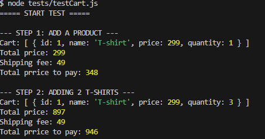
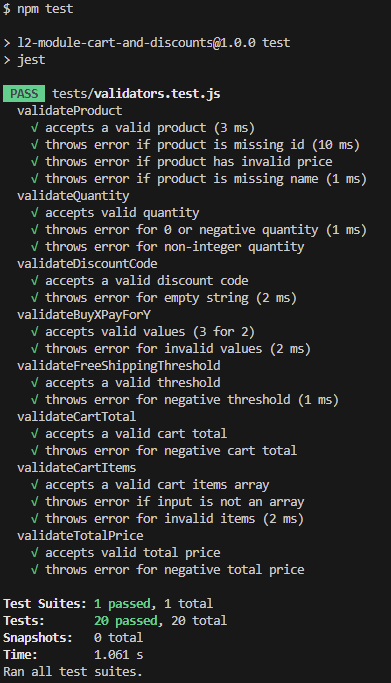

# Shopping Cart Module - Test Report

## Objective

The purpose of this document is to provide an overview of the testing performed in this project and to document the individual manual and automated test cases.

## Scope – What will be tested and how?
The main focus is testing the **Cart handling**, **Discount logic (DiscountManager)**, and **Validation functions (validators)**.  
Testing is divided into two parts:  
- **Manual testing**: Performed via a custom test file (`tests/testCart.js`) executed in Node.js, with results logged in the console.  
- **Automated unit testing**: Performed with Jest (`tests/validators.test.js`) to ensure validation and error handling work correctly.

## Goals with testing
- Verify that the cart correctly handles adding, removing, and clearing items.  
- Verify that shipping costs are calculated correctly.
- Ensure discount codes and “buy X pay for Y” rules (3-for-2) apply correctly.  
- Confirm that validator functions throw errors for invalid input.

## Test Areas and Approach

### Add/Remove Products (TC1.1 – TC1.3)  
**What:** Verify products can be added, incremented, decremented, and removed.  
**How:** Use `cart.addProductToCart()` and `cart.removeProductFromCart()`. Compare output with expected item count.  

### Clear Cart (TC2.1)  
**What:** Ensure `clearCart()` fully empties the cart.  
**How:** Add products, then run `clearCart()`.  

### Shipping Costs (TC3.1 – TC3.2)  
**What:** Verify correct shipping fees and free shipping threshold.  
**How:** Use `discountManager.setFreeShippingThreshold()` and `cart.getShippingCost()`.  

### Discount Codes (TC4.1)  
**What:** Validate discount codes.  
**How:** Apply `SOMMAR25` with `discountManager.applyDiscountCode()`.  

### Buy X Pay For Y (TC5.1)  
**What:** Verify “3-for-2” rule works.  
**How:** Add 3 products and apply `discountManager.buyXPayForY(3,2)`.  

### Validators (TC6.1 – TC6.6)  
**What:** Verify invalid input triggers errors.  
**How:** Automated Jest tests.  

## Test Goals
The goal of testing is to confirm that the module behaves correctly. 

---

## Test Strategy
Testing is performed in two layers:  
- **Manual testing:** End-to-end scenarios run in Node.js via the cart test file.  
- **Automated unit testing:** Validator logic is tested with Jest.  

---

## Manual Testing – Test Cases

### TC1.1 – Add Product
**Scenario:** User adds 1 T-shirt.  
**Steps:**  
1. Create a `Cart`.  
2. Run `cart.addProductToCart(productA, 1)`.  
**Expected:** Product exists in `cart.items`.  

### TC1.2 – Increase Quantity
**Scenario:** User adds the same product again.  
**Steps:**  
1. Run `cart.addProductToCart(productA, 2)`.  
**Expected:** Quantity increases to 3 in total.  

### TC1.3 – Remove Product
**Scenario:** User removes 1 T-shirt.  
**Steps:**  
1. Run `cart.removeProductFromCart(productA, 1)`.  
**Expected:** Quantity decreases by 1.  

### TC2.1 – Clear Cart
**Scenario:** User empties the cart.  
**Steps:**  
1. Run `cart.clearCart()`.  
**Expected:** `cart.items` is empty.  

### TC3.1 – Shipping Cost
**Scenario:** Cart value is below free shipping threshold.  
**Steps:**  
1. Set shipping cost to 49.  
2. Run `cart.getShippingCost()`.  
**Expected:** Shipping = 49.  

### TC3.2 – Free Shipping
**Scenario:** Cart value exceeds free shipping threshold (1000 SEK).  
**Steps:**  
1. Add sneakers (1200 SEK).  
2. Run `cart.getShippingCost()`.  
**Expected:** Shipping = 0.  

### TC4.1 – Discount Code
**Scenario:** User applies discount code `SOMMAR25`.  
**Steps:**  
1. Run `discountManager.applyDiscountCode("SOMMAR25")`.  
2. Check total.  
**Expected:** Total decreases by 25%.  

### TC5.1 – 3-for-2 Rule
**Scenario:** User adds 3 hoodies and applies 3-for-2.  
**Steps:**  
1. Run `cart.addProductToCart(productC, 3)`.  
2. Run `discountManager.buyXPayForY(3,2)`.  
**Expected:** Only 2 hoodies are charged.  

---

## Manuell Test Results

| What was tested                           | How it was tested                                                                 | Result |
|-------------------------------------------|-----------------------------------------------------------------------------------|--------|
| Add product to cart                       | Manual test script: added 1 T-shirt → checked `cart.items` and `getTotalPrice`    | ✅ Pass |
| Remove product from cart                  | Manual test script: removed 1 T-shirt → verified quantity updated                 | ✅ Pass |
| Clear cart                                | Manual test script: called `clearCart()` → verified `cart.items` empty            | ✅ Pass |
| Shipping cost calculation                 | Manual test script: set shipping to 49 SEK → verified applied correctly           | ✅ Pass |
| Free shipping threshold                   | Manual test script: set threshold 1000 → verified shipping removed above limit    | ✅ Pass |
| Apply discount code                       | Manual test script: used `SOMMAR25` → verified total reduced                      | ✅ Pass |
| Apply “3 for 2” rule                      | Manual test script: added 3 hoodies → verified one free                           | ✅ Pass |

## Exampel code

A full test script is included in the `tests` folder demonstrating all features. Here’s a **short example** from the test script:

```js
import { Cart } from "l2-module-cart-and-discounts"

console.log("===== START TEST =====")

const cart = new Cart()

const productA = { id: 1, name: "T-shirt", price: 299 }
const productB = { id: 2, name: "Sneakers", price: 1200 }
const productC = { id: 3, name: "Hoodie", price: 600 }

cart.discountManager.setFreeShippingThreshold(1000)
cart.discountManager.shippingCost = 49

console.log("\n--- STEP 1: ADD A PRODUCT ---")
cart.addProductToCart(productA, 1)
console.log("Cart:", cart.items)
console.log("Total price:", cart.getTotalPriceafterDiscounts())
console.log("Shipping fee:", cart.getShippingCost())
console.log("Total prrice to pay:", cart.getFinalPrice())

console.log("\n--- STEP 2: ADDING 2 T-SHIRTS ---")
cart.addProductToCart(productA, 2)
console.log("Cart:", cart.items)
console.log("Total price:", cart.getTotalPriceafterDiscounts())
console.log("Shipping fee:", cart.getShippingCost())
console.log("Total prrice to pay:", cart.getFinalPrice())

```

Output:




## Unit Tests Result

| Function | Test Cases | Result |
|----------|-----------|--------|
| `validateProduct` | Valid product, missing ID, negative price, missing name | Passes for valid, throws `CartError` for invalid |
| `validateQuantity` | Positive integers, zero, negative, non-integer | Throws `CartError` for invalid, passes for valid |
| `validateDiscountCode` | Valid code, empty string | Throws `DiscountError` for empty, passes for valid |
| `validateBuyXPayForY` | Valid values (e.g., 3 for 2), invalid values | Passes for valid, throws `DiscountError` for invalid |
| `validateFreeShippingThreshold` | Positive number, negative number | Passes for valid, throws `DiscountError` for invalid |
| `validateCartTotal` | Non-negative total, negative total | Passes for valid, throws `DiscountError` for invalid |
| `validateCartItems` | Valid array of items, invalid array, invalid item fields | Passes for valid, throws `DiscountError` for invalid |
| `validateTotalPrice` | Non-negative number, negative number | Passes for valid, throws `DiscountError` for invalid |

All validator functions passed.



To run all unit test first install the dependencies:

`npm install`

then run:

`npm test` in the terminal
