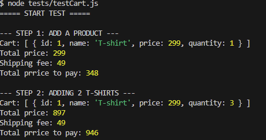

# Shopping Cart Module - Test Report

## 1. Introduction

This test report covers the functionality of the Shopping Cart module, including:
- Product validation
- Quantity handling
- Discount application
- Shipping cost calculation

## 2. Unit Tests

| Function | Test Cases | Result |
|----------|-----------|--------|
| `validateProduct` | Valid product, missing ID, negative price, missing name | Passes for valid, throws `CartError` for invalid |
| `validateQuantity` | Positive integers, zero, negative, non-integer | Throws `CartError` for invalid, passes for valid |
| `validateDiscountCode` | Valid code, empty string | Throws `DiscountError` for empty, passes for valid |
| `validateBuyXPayForY` | Valid values (e.g., 3 for 2), invalid values | Passes for valid, throws `DiscountError` for invalid |
| `validateFreeShippingThreshold` | Positive number, negative number | Passes for valid, throws `DiscountError` for invalid |
| `validateCartTotal` | Non-negative total, negative total | Passes for valid, throws `DiscountError` for invalid |
| `validateCartItems` | Valid array of items, invalid array, invalid item fields | Passes for valid, throws `DiscountError` for invalid |
| `validateTotalPrice` | Non-negative number, negative number | Passes for valid, throws `DiscountError` for invalid |

All validator functions passed the expected scenarios, ensuring robust input handling.


To run all unit test first install the dependencies:

`npm install`

then run:

`npm test` in the terminal

## 3. Use Case / End-to-End Test

A full test script is included in the `tests` folder demonstrating all features. Here’s a **short example** from the test script:

```js
import { Cart } from "l2-module-cart-and-discounts"

console.log("===== START TEST =====")

const cart = new Cart()

const productA = { id: 1, name: "T-shirt", price: 299 }
const productB = { id: 2, name: "Sneakers", price: 1200 }
const productC = { id: 3, name: "Hoodie", price: 600 }

cart.discountManager.setFreeShippingThreshold(1000)
cart.discountManager.shippingCost = 49

console.log("\n--- STEP 1: ADD A PRODUCT ---")
cart.addProductToCart(productA, 1)
console.log("Cart:", cart.items)
console.log("Total price:", cart.getTotalPriceafterDiscounts())
console.log("Shipping fee:", cart.getShippingCost())
console.log("Total prrice to pay:", cart.getFinalPrice())

console.log("\n--- STEP 2: ADDING 2 T-SHIRTS ---")
cart.addProductToCart(productA, 2)
console.log("Cart:", cart.items)
console.log("Total price:", cart.getTotalPriceafterDiscounts())
console.log("Shipping fee:", cart.getShippingCost())
console.log("Total prrice to pay:", cart.getFinalPrice())

```

This use case demonstrates realistic shopping scenarios with multiple products, discounts, and shipping calculation.

Output:

